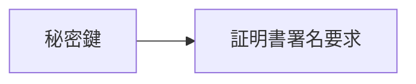
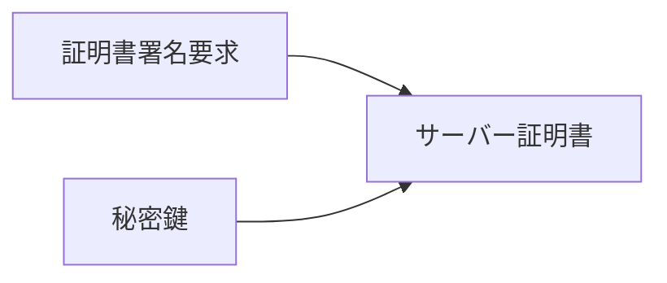

# WebRTCとはなんぞや？

WebRTC = **Web Real-Time Communication**の略

大雑把に言えば、カメラやマイクを扱ったテレビ会議のようなアプリや、チャットといったデータ通信を行うための規格、技術？といったところ。


厳密には「ビデオ、オーディオ、データ通信を行うための仕組み」という事になりそうではあるが、必然的にカメラやマイクといったデバイスの扱いや、関連するvideoタグやaudioタグ、Canvasといった技術も一緒に扱う事が多く、世の中のサンプルもそういう内容のものが多いと感じた。


## とりまカメラにアクセスしてみる

```html
<!doctype html>
<html>
<head>
 <meta http-equiv="Content-Type" content="text/html; charset=UTF-8">
 <title>カメラにアクセスしてみる</title>
</head>
<body>
  <video id="local_video" autoplay style="width: 640px; height: 480px; border: 1px solid #999;"></video><br>
  <button onclick="startVideo()">Start</button>
</body>
<script type="text/javascript">
  let localVideo = document.getElementById('local_video');
  
  function startVideo() {
    navigator.mediaDevices
      .getUserMedia({video: true, audio: false})
      .then(function (stream){
        localVideo.srcObject = stream;
      })
      .catch(function (error){
        console.error('mediaDevice.getUserMedia() error:', error);
      });
  }
</script>
</html>
```


## 今後に向けて

WebRTCで何かしたい場合は、ローカル環境であろうと`https`に対応したサーバーを作ってしまう方がめんどうが少ない気がする。

ブラウザによるところもあるが、Chromeの場合はカメラやマイクなどのデバイスは原則`https`、また例外として`http://localhost/~`で利用可能だが、そうでないとカメラやマイクなどのデバイスが扱えない。

複数台の端末でP2Pとか色々やろうと思うと最初から`https`にしておくほうがムカつく事が減る気がする。


## さくっとhttpsローカルサーバー(Windows)

### 準備するもの

Node.js環境はあるものとして、その他に用意するもの

- Git Bash

  Git for Windowsをインストールすることで自動的にインストールされるBash、Windows上でUnixやLinuxのようなUnixコマンドが扱える。

- http-server

  簡単にサーバーを立てられるNode.jsで使えるパッケージ


### SSL証明書の発行(自己証明)

SSL証明書の発行には`openssl`コマンドを使う、通常のWindowsのコマンドプロンプトとかだとこのコマンドはないが、`Git Bash`だと使える。


SSL証明書の発行には3つのステップがある。


1. 「秘密鍵」を作る
2. 秘密鍵を元に「証明書署名要求」を作る
3. 「秘密鍵」と「証明書署名要求」から「サーバー証明書」を作る


具体的なやり方を１つずつ見ていく。


**秘密鍵の生成**

秘密鍵の作成には`openssl genrsa`を使う、パラメータには鍵長を指定、2048bitとした。

```
openssl genrsa 2048 -out server.key 
```


**証明書署名要求(CSR/Certificate Signing Request)の作成**



証明書署名要求の新規作成には`openssl req -new`を使う、また作成には秘密鍵が必要になるので`-key`オプションで秘密鍵を指定する。

```
openssl req -new -key {秘密鍵} -out {出力ファイル名} -subj {サーバーの設定情報}
```

`-subj`はサーバーがどこの国にあるだとか、そういったサーバーの情報を指定する。


具体例：

```
openssl req -new -key server.key -out server.csr -subj "//C=JP/ST=Tokyo/L=Tokyo-to/O=Sample/OU=Dev1/CN=devdev.com"
```

- `-subj`の補足
  - C:国名
  - ST:都道府県名
  - L:市区町村
  - OU:部署名
  - CN:サーバー名


**サーバー証明書の作成**




サーバー証明書は、本来であれば作成した「証明書署名要求」を然るべき機関に送付して認証局の秘密鍵で署名してもらうらしいけど、今回は開発用のものなので自分で署名することでサーバー証明書を作成する。

サーバー証明書は`openssl x509 -req`を使う。

```
openssl x509 -req -in {証明書署名要求} -out {出力ファイル名} -signkey {秘密鍵} -days {有効期限} -sha256
```

`-in`オプションに続いて「証明書署名要求」を指定する。

また`-signkey`は署名鍵を指定する、今回は自分で署名するので「自分の秘密鍵」を指定する。

`-days`は証明書の有効期限で10年間。


具体例：

```
openssl x509 -req -in server.csr -out server.crt -signkey server.key -days 3650 -sha256
```

ここで作成したサーバー証明書をサーバーに配置することで、`https`が利用可能になる。


### サーバーを立ち上げる

サーバーには`http-server`を利用する、入れてなければ`yarn global add http-server`などでインストール。

`http-server`でサーバーを起動する際に、秘密鍵とサーバー証明書を指定して起動する。

```
http-server -c-1 {ドキュメントルートのパス} --ssl --key {秘密鍵のパス} --cert {サーバー証明書のパス}
```

`-c`はキャッシュ時間を指定するオプション、キャッシュを無効にするには、`-c-1`を使用します。

```
http-server -c-1 . --ssl --key ./ssl/server.key --cert ./ssl/server.crt
```

