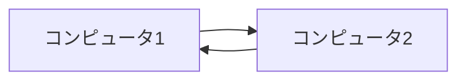
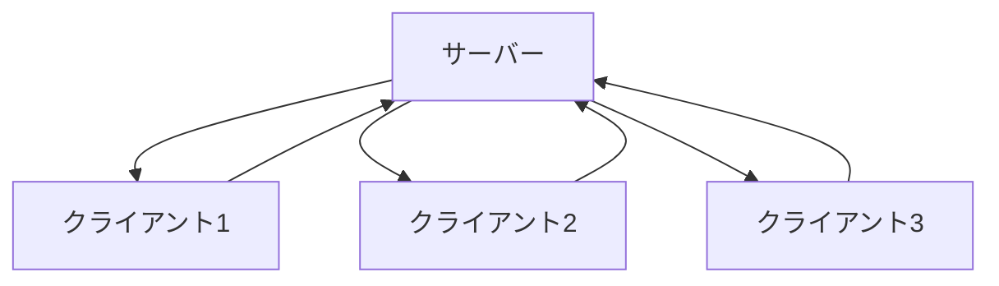
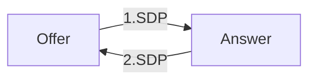
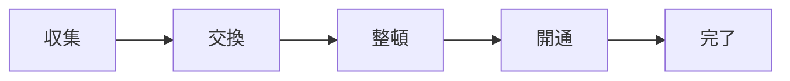
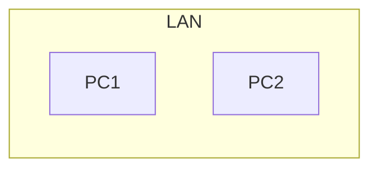
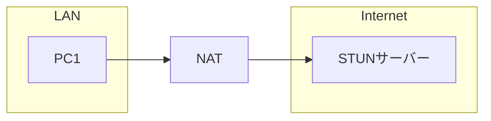
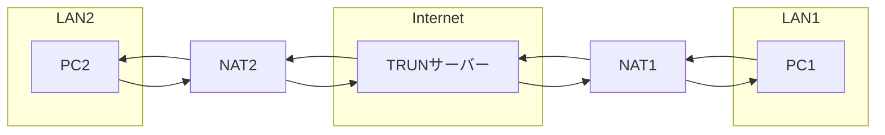
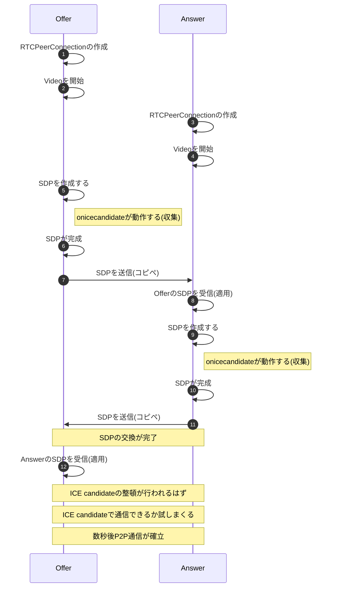

# ブラウザ間でP2P通信の確立

異なるブラウザでカメラの映像をやり取りする。

## 動作確認

- 資料置き場：https://github.com/kurodakazumichi/youtube/tree/main/IntruductionToWebRTC/02
- カメラが必要
- index.html
- main.js
- サーバーを立てる


## 学んだこと

- P2P
- RTCPeerConnection
- NAT超え
- STANサーバー
- TURNサーバー
- ICE
- SDP
- Vanilla ICE
- Trickle ICE


## P2Pとは何か

P2P = Peer to Peerの略で、Peerとは**同等**という意味を持つ。

P2Pは複数台のコンピューターがサーバーを介さずに、端末同士で直接やりとりできる通信技術やソフトウェアの事を指す。



P2Pとは別にクライアント・サーバー型という手法がある。

これはウェブサービスなどでは一般的な通信手法である、サーバーを介してクライアントはデータのやり取りを行い、クライアント同士で直接やりとりはしない。



P2P通信する場合、お互いの住所(IPとか)など、通信に必要な情報がわからないと通信することができないため、まず最初はクライアント・サーバー方式でサーバーを介して情報交換しP2P通信を確立し、P2P通信を開始したあとはサーバーを介さず端末同士でやりとりを行うという流れが一般的である。


## WebRTCでP2P通信を確立するのに登場する技術や用語

### RTCPeerConnection

> MDNから引用：
>
> **`RTCPeerConnection`** インターフェイスはローカルコンピューターとリモートピア間の WebRTC コネクションを表現します。このインターフェイスはリモートピアへ接続や、その接続の保守や監視するメソッド、さらに、不要になった接続を閉じるメソッドを提供します。

ざっくり言ってしまえば、JavaScriptでP2P通信をする際にキモとなるオブジェクトという感じだろうか

通信に必要な情報を取得したり、通信の状態や、データの送受信を行うのに必要なAPIが詰まっていて、WebRTCで何かしようとなると`RTCPeerConnection`に触れる事になる。

特徴として、P2P通信、UDP/IPを使う、暗号化通信を行う、ポート番号は自動的に割り振られる。


### SDP(Session Description Protocol)

WebRTCで通信を行う場合、まずはお互いにどんな通信を行うかなどの情報を確認し合う必要がある。

SDPは通信に関してどのようなデータ(映像や音声)を扱うかであったり、通信経路に関する情報を表す**データ形式**で以下のようなテキストである。

```
m=video 54391 UDP/TLS/RTP/SAVPF 96 97 98 99 100 101 127 121 125 107 108 109 124 120 123 119 35 36 41 42 114 115 116 117 118
c=IN IP4 172.28.0.1
a=rtcp:9 IN IP4 0.0.0.0
a=candidate:121182044 1 udp 2122260223 172.28.xxx.xxx 54391 typ host generation 0 network-id 1
a=candidate:2476205824 1 udp 2122194687 172.21.xxx.xxx 54392 typ host generation 0 network-id 5
...
```


### OfferとAnswer

SDPには通信を始める側(Offer)と、通信を受ける側(Answer)があり、必ずOffer → Answerの順番でやり取りをする必要がある。





### ICE (Interactive Conectivity Establishment)

ICEはお互いが通信可能な経路を見つける(確認する)ための**プロトコル**です。

ICEはSDPでお互いに通信に関する情報を交換したあと、通信に利用できそうな経路をピックアップする役割を果たす。

また、ICEによってピックアップされた通信経路の候補を**ICE Candidate**と呼ぶ

#### ICEの基本の流れ



1. まず使えそうな通信経路を収集しまくる
2. OfferとAnswerで情報を交換
3. 使えそうな経路や効率の良さそうな経路などを判断して整頓
4. 良さそうな経路から繋がるまで通信を試しまくる
5. 繋がったら終了

[WebRTCのICEについて知る](https://www.slideshare.net/iwashi86/webrtcice)、ここがわかりやすかった。


### STUNサーバー・TURNサーバとかの話

WebRTCの勉強中にやたらと出てきたSTUNサーバー、TURNサーバー、またNAT超えなどについて記載しておく。

(そこまで詳しくわかっていないけど、ここで残しておかないと完全にわすれてしまいそうなので)


P2P通信を確立する場合は通信する相手の住所、つまりIPアドレスやポート番号が必要になる。

通信相手が同じネットワーク、例えば家の中のLANにある場合であればローカルIPアドレスがわかればお互いに通信することが可能である。



しかしインターネットの先の別のネットワークの相手と通信したいとなった場合、通信相手には自分のローカルIPではなくグローバルIPを伝えないといけないが、通常自分のグローバルアドレスが何なのかというのはすぐにはわからないのである。

そこでグローバルIPを教えてくれるサーバーを用意する、これを**STUNサーバー**というらしい。



NATはNetwork Address Translationの略で、「ネットワークアドレス変換」とも呼ぶ。

これは、LANに接続された端末からインターネットに接続する際に、「プライベートIPアドレス」を自動的に「グローバルIPアドレス」に変換する機能で、基本的にインターネットにつなぐ際はNATを経由している。

STUNサーバーはInternet上に構築する、PC1がSTUNサーバーにアクセスする際はNATによりグローバルIPに変換されているため、STUNサーバーはPC1のグローバルIPを知る事ができる、このグローバルIPをPC1に教える役割を担っている。

このNATを超えるには、STUNサーバーのような一手間が必要であり、これをNAT超えが必要とか、NAT超え問題とか書いてる人がいたと思う。


続いて、TURNサーバーだが、このサーバーは必須というわけではないらしい。

STUNサーバーでNAT超えをすれば、P2P通信ができそうな気もするが、それでも繋がらないネットワークケースがあるらしく、必要な場合はTURNサーバーを構築するとのこと(Firewallとかセキュリティ的な話で繋がらないとか、よくわかってないのでいつか調べよう)


TRUNサーバーはデータの中継を行うサーバーで、来たデータをそのまま流すらしい。



TRUNサーバーは中継役でしかないが、PC1はTRUNサーバーとやり取りをし、PC2もTRUNサーバーとやり取りをしているだけなので、実質P2Pではないが、こういう構成もあるらしい。

ただデータを中継するTRUNサーバーは全てのデータがこのサーバーを経由するためにサーバーの負荷とか結構すごくなるってどこかで見た気がする。


今回の動画ではSTUNサーバーやTURNサーバーは実装しないし登場もしないが、WebRTCを学ぶ際にはおそらく目にする単語のはずなので、ここである程度知っておく方が予後がよろしいのではないかと思う。


### ICE VanillaとICE Trickle

これはP2P通信を確立する際の手順というか、実装方法の違いみたいなものなので後述することにする。


## 実演

今回はP2P通信を手動で確率していく、とりあえずP2Pを確立しカメラの映像を相互にやりとりするサンプルを動かし雰囲気を掴んでから細かく見ていく。


## P2P通信を確立する流れ




## 実装

### 画面

`index.html`を作って、[ここのコード](https://github.com/kurodakazumichi/youtube/blob/main/IntruductionToWebRTC/02/index.html)をコピペする。


### 準備

- グロバール変数定義
- domの取得


## RTCPeerConnectionの作成

```js
function createConnection() 
{
  console.log("called: createConnection.");

  // configには必要であればSTUNサーバーのURLなどを指定する
  let pc_config = {"iceServers":[]};
  pc = new RTCPeerConnection(pc_config);
  peerConnection = pc;
}
```

コネクションを作成する際に指定する`iceServers`について、今回はLAN内(というか同じPC)なので特に必要ないが、NAT超えなどが必要な場合、通信経路の確保のためSTUNサーバーのURLを指定したり、TURNサーバーを使うならTURNサーバーのURLを指定する事になると思われる。

[公式ドキュメント](https://developer.mozilla.org/ja/docs/Web/API/RTCPeerConnection/RTCPeerConnection)


### Videoを開始

- videoデバイスから映像(メディア)を取得
- コネクションにメディアを登録
- 映像をブラウザに映す


コネクションには何かしらやりとりするデータ(映像、音声、その他)を関連付けしないと、SDPの作成ができないようである。

今回は映像を関連付けしたが、映像を関連付けせずに、下記のように`Datachannel`を作成してもSDPは作成できた。

```js
var channel = pc.createDataChannel("chat");
channel.onopen = function(event) {
  channel.send('Hello!');
}
channel.onmessage = function(event) {
  console.log(event.data);
}
```

やり取りするデータが何一つないような状態ではSDPの作成に失敗するっぽい。


### Offer側：SesionDescription(SDP)を作成する

- SessionDescriptionは通信に関する情報、おおよそSDPと捉えて良さそう
- `RTCPerrConnection.createOffer()`で作成
- `RTCPeerConnection.setLocalDescription(data)`でローカルにSDPを保存
- `onicecandidate`が動作し、通信経路候補の情報が取得できる
- `onicecandidate`が終わるまで待つ
- textareaにSDPの内容を表示


#### ICE VanillaとICE Trickle

ICEはまず通信経路に使えそうな情報、`ICE candidate`をとにかく集める。

この`ICE candidate`を全て集めてから相手と交換する方法を**ICE Vanilla**(愚直)と呼んでおり、`ICE candidate`が見つかったそばから逐一相手と交換をするという方法を**ICE Trickle**というらしい。

今回は`ICE candidate`が全て集まるのをまってから交換(コピペ)しているので、**ICE Vanilla**という事になる。

一般的には**ICE Trickle**の方が、候補が見つかるたびにとりあえず繋がるか試していくので動作は早い。


### Answer側：OfferのSDPを受け取る

- Offerの通信情報であるSDPを受け取る、SDPを受け取りさえできればやり方は何でも良いが今回は手動(コピペ)で交換する。
- 受け取ったSDPから`SessionDescription`を作成する
- `new RTCSessionDescription()`を使う
- `RTCPeerConnection.setRemoteDescription(data)`で保存する


### Answer側：SessionDescription(SDP)を作成する

- Offer側だけじゃなく、Answer側も`SessionDescription`を作成する。
- `RTCPerrConnection.createAnswer()`で作成
- `RTCPeerConnection.setLocalDescription(data)`でローカルにSDPを保存
- `onicecandidate`が動作し、通信経路候補の情報が取得できる
- `onicecandidate`が終わるまで待つ
- textareaにSDPの内容を表示


### Offer側：AnswerのSDPを受け取る

- Answer側のSDPを受け取る、ここも受け取りさえすればいいので手動(コピペ)で受け取る
- 受け取ったSDPから`SessionDescription`を作成する
- `new RTCSessionDescription()`を使う
- `RTCPeerConnection.setRemoteDescription(data)`で保存する
- しばらくするとP2P通信が確率され、映像が同期される。


# 参考

- [手動でWebRTCの通信をつなげよう ーWebRTC入門2016](https://html5experts.jp/mganeko/19814/)
- [P2P(ピアツーピア)とは？仕組みから活用例まで詳しく解説](https://udemy.benesse.co.jp/development/blockchain/p2p.html)
- [ピア・ツー・ピア | IT用語辞典 | 大塚商会](https://www.otsuka-shokai.co.jp/words/p2p.html)
- [【初心者向け】STUN/TURNサーバをざっくり解説してみた](https://qiita.com/okyk/items/a405f827e23cb9ef3bde)
- [WebRTC の STUN, TURN, ICE とは何なのか](https://qiita.com/takano-h/items/409a8a7af7d4a2b42f90)
- [WebRTC Meetup](https://youtu.be/6v4rvLiUCvM?t=47m17s)
- [初心者必見！よくわかるWebRTCの仕組み](https://cloudapi.kddi-web.com/magazine/webrtc/understood-webrtc-mechanism)
- [WebRTCのICEについて知る](https://www.slideshare.net/iwashi86/webrtcice)
- [シスコ コラボレーションにおける ICE の概要 - Cisco ...](https://community.cisco.com/t5/コラボレーション-ドキュメント/シスコ-コラボレーションにおける-ice-の概要/ta-p/3842143)
- [`RTCPeerConnection`](https://developer.mozilla.org/en-US/docs/Web/API/RTCPeerConnection)
