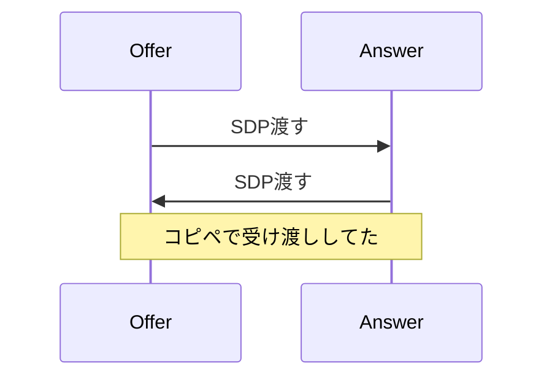
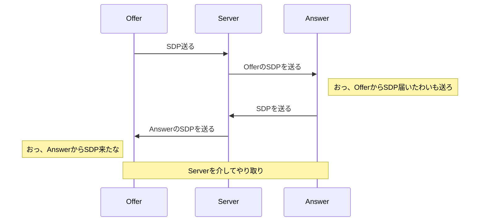
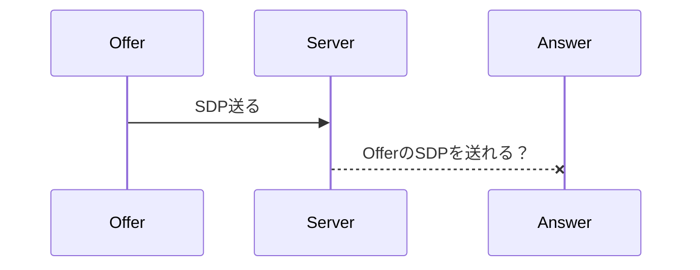
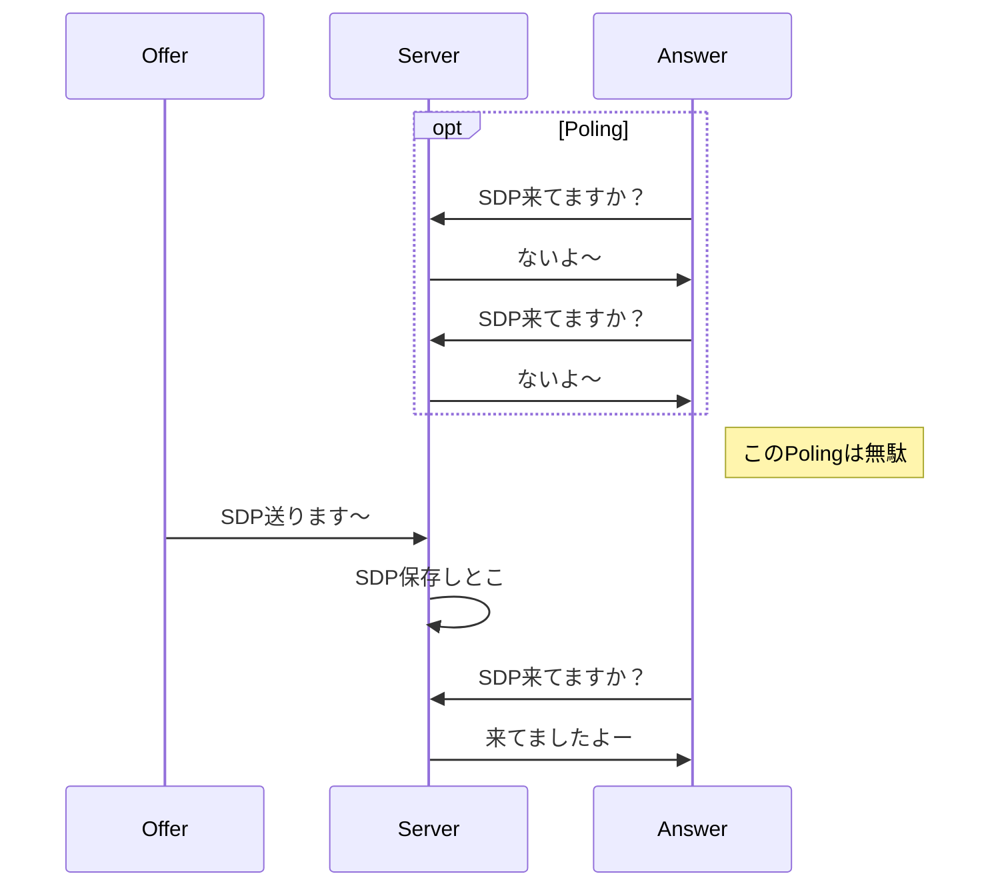
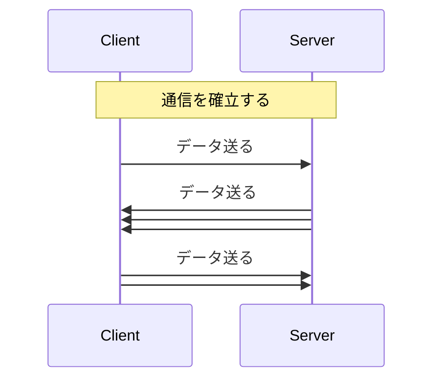
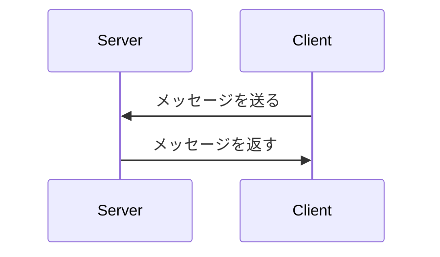
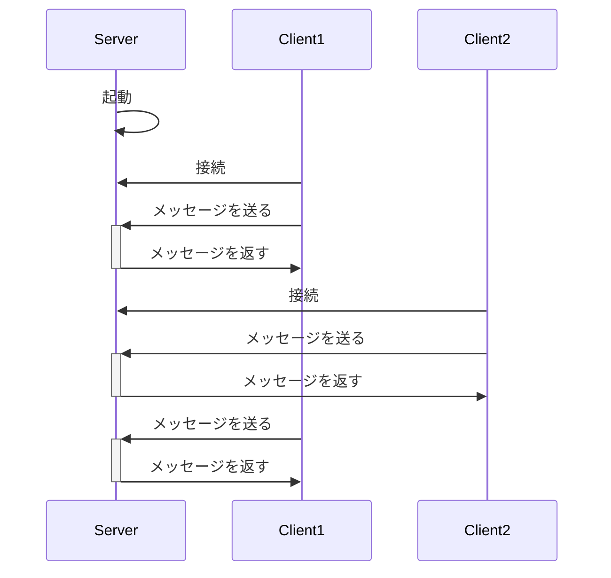
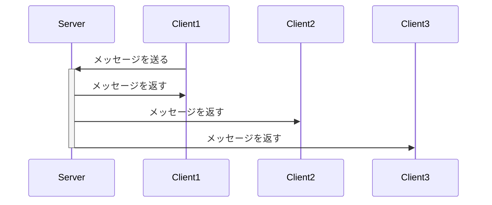
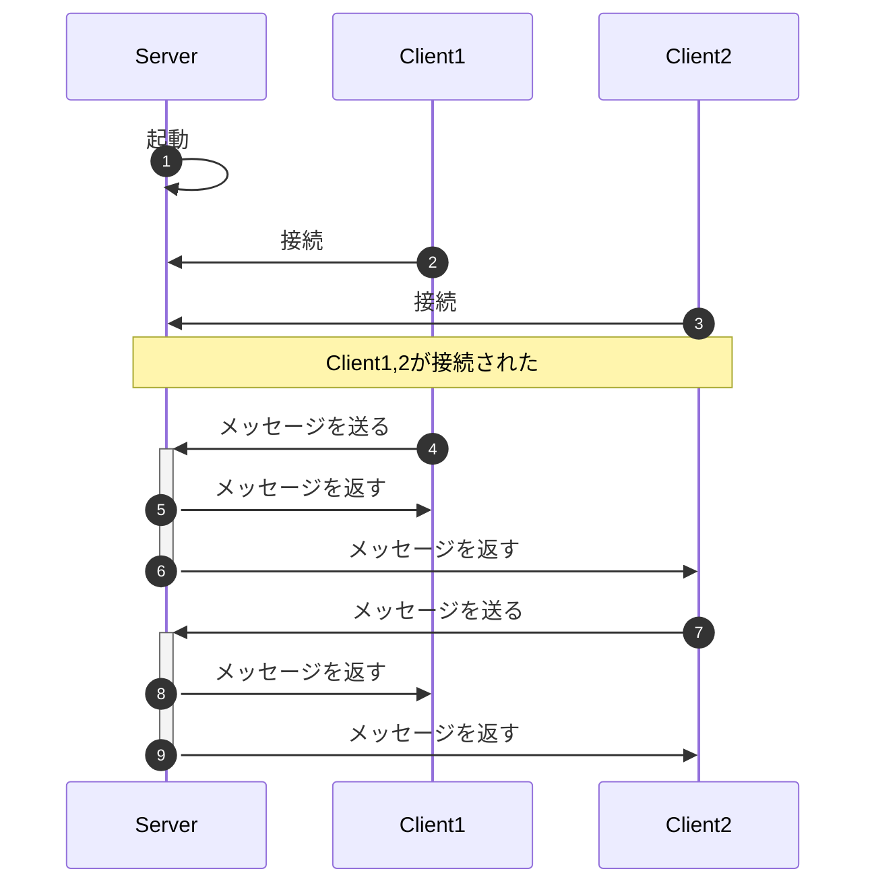
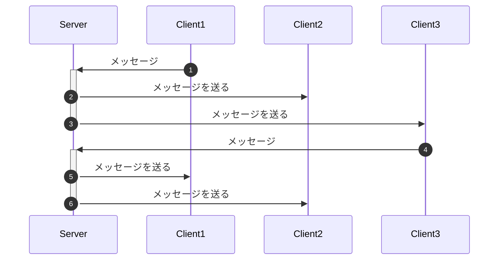

# WebSocketServerを作る

最終的にやりたいのはSDPの情報を交換するための**シグナリングサーバー**を実装することなんだけど、その前にシンプルなWebSocketServerを作るところから始めたいと思う。


## 事情

### 前回の話

前回、OfferとAnswerはSDPの内容をコピペで受け渡しをしていた。




### 未来の話

これをコピペではなく、サーバーを経由してSDPの交換をするようにしたい




真ん中のサーバーのことを「シグナリングサーバー」と呼ぶ。

> シグナリングサーバーは「通信相手に関する情報を得る」のが役割で、WebRTCにおいて欠かせないサーバーです。


### 問題点について

ここで1つ問題があり

OfferからServerにSDPを送るのはいいとして、ServerからAnswerにどうやってSDPを送るのか



通常のウェブの仕組みでは、リクエストはクライアント側からサーバー側に対してしか行えない。

この問題に関して、今までは一定間隔でリクエストを送り続ける(Poling)とか、あの手この手でなんとかしてきていたのである。




### 救世主について

そんな問題を解決するべく登場したのが救世主「**WebSocket**」である。

WebSocketはクライアントとサーバー間で通信を確立したあと、相互にデータのやり取りが行える仕組みである。




WebSocketを使うことで、クライアントからサーバーに対してデータを送れるし、その逆も可能になる、つまりWebSocketを使えば、最初にやりたかったSDPの交換をする**シグナリングサーバー**が実現できる。


前回まで扱っていた`WebRTC`はクライアント同士のP2Pだったが、`WebSocket`はクライアントとサーバー同士のP2Pみたいな感じだと思った。


### WebSocketを使うために

- `WebSocket`は`http`や`https`ではなくた、`ws`や`wss`というプロトコルを使い、WebSocketに対応したサーバーが必要である。
- Node.jsを使えばすぐ作れる


### まずWebSocketServer

最終的にはSDPを交換する**シグナリングサーバー**を作りたいのだが、そのまえにシンプルなWebSocketServerを実装する。

何事も最初はシンプルに、余計なことを絡めずにやりたい派。


## WebSocketServerの実装

### 環境準備

- Node.js
- nodemon
- wscat

```
yarn add ws
yarn global add nodemon
yarn global add wscat
```

`nodemon`は`js`が変更されたら自動的に実行しなおしてくれる便利ツールで、`wscat`はコマンドラインからWebSocketServerにリクエストを出せる便利コマンド(テストしやすくなる)


### 準備

WebSocketを扱うために`ws`パッケージを導入する。

```
yarn init -y
yarn add ws
```


### シンプルなWebSocketServer

接続があったら`connected`と表示するだけのサーバー

```js
const WebSocketServer = require('ws').Server;
const port = 3000;
const wsServer = new WebSocketServer({port});
console.log("'websocket server start. port=", port);

wsServer.on('connection', (me) => 
{
  console.log("connected");
})
```


#### サーバーを立ち上げる

上記プログラムを`server.js`と言う名前で作成しターミナルで`nodemon server.js`とすればサーバーが立ち上がる。


#### サーバーに接続してみる

- WebSocketServerに接続するにはクライアント側のプログラムも用意しなければいけないが、ちょっと動作確認するためにいちいち用意するのもめんどくさい、そこで便利なのが`wscat`というパッケージ。
- `wscat`はコマンドラインからWebSocketServerに簡単に接続でき、またデータのやり取りもできる、まずはこれを使ってWebSocketServerとの通信を行ってみる。


#### wscatの使い方

```
wscat -c {サーバーのURL}
```

このコマンドを実行するとコマンドラインが入力できる状態になり、そこで入力した内容がWebSocketServerに送られる、サーバーから何かメッセージが届いた場合はそのメッセージが表示される。


具体例：

```
wscat -c ws://localhost:3000
```


### Echo サーバー

クライアントが送ったメッセージをそのまま返してくるようにしてみる。




```js
wsServer.on('connection', (me) => 
{
  console.log("connected");

  me.on('message', (msg) => {
    console.log("recv:" + msg);
    me.send("echo:" + msg);
  });
})
```


クライアントが増えた場合、メッセージを送った本人にしかメッセージは返ってこない状態




### Chat サーバー

クライアントが送ったメッセージを接続してるクライアント全員に返してくるサーバーにしてみる。



```js
wsServer.on('connection', (me) => 
{
  console.log("connected");

  me.on('message', (msg) => 
  {
    console.log(msg.toString());
    wsServer.clients.forEach((client) => {
      client.send(msg);
    });
  });
})
```


イメージはこんな感じ、誰かからメッセージが来たら、全員にメッセージを送り返す




#### メッセージを送った人以外にメッセージを返すようにしてみる



```js
wsServer.on('connection', (me) => 
{
  console.log("connected");

  me.on('message', (msg) => 
  {
    console.log(msg.toString());

    wsServer.clients.forEach((client) => 
    {
      if (me !== client) {
        client.send(msg);
      }
    });
  });
})
```


## ブラウザとサーバーでWebSocketを使って通信

- 最後は`wscat`ではなく、ブラウザとサーバーでWebSocketを使った簡易チャットのようなものをつくって終わりにしたい。
- サーバーは既に作成したものを使うとして、ブラウザ側のプログラムを新たに作成する(index.htmlだけでやっちゃう)


### UIを作る

`index.html`を作って以下をコピペ

チャットのメッセージを表示する部分とメッセージを送信する部分を作る、必要な要素は取得しておく。

```html
<!DOCTYPE html>
<html lang="js">
<head>
  <meta charset="UTF-8">
  <meta http-equiv="X-UA-Compatible" content="IE=edge">
  <meta name="viewport" content="width=device-width, initial-scale=1.0">
  <title>シンプルチャット</title>
</head>
<body>
  <ul id="messages"></ul>
  <input id="message" size="50"><button onclick="sendMessage()">送信</button>
  <script>
    const dom = {
      messages: document.getElementById("messages"),
      message : document.getElementById("message")
    }
  </script>
</body>
</html>
```


### WebSocketServerと接続

WebSocketServerに接続し、接続開始、接続エラー時のコールバックを設定

```js
const wsUrl = 'ws://localhost:3000';
const ws = new WebSocket(wsUrl);

ws.onopen = (e) => {
  console.log('ws open()');
}

ws.onerror = (e) => {
  console.error('ws onerror() ERR:', err);
}
```


### メッセージ送信処理の実装

- 入力されたメッセージをサーバーに送信する処理を実装
- 送信したメッセージをメッセージ一覧に追加

```js
function sendMessage() 
{
  const msg = dom.message.value;
  dom.message.value = "";
  dom.message.focus();

  if (msg) {
    addMessage(msg);
    ws.send(msg);
  }  
}

function addMessage(msg) {
  const item = document.createElement("li");
  item.innerText = msg;
  dom.messages.appendChild(item); 
}
```


### メッセージ受信処理の実装

```js
ws.onmessage = async (e) => {
  const msg = await e.data.text();
  addMessage(msg);
}
```


### 補足

今回用意したサーバーは、送信者以外のメンバーに対してメッセージを返すようにしていたが、チャットであれば送信者含めて全員にメッセージを返すようにしたほうがクライアント側の実装は楽だったかもしれない。


## 参考

- [シグナリングサーバーを動かそう ーWebRTC入門2016](https://html5experts.jp/mganeko/20013/)
- [WebSocket の検証では wscat が便利だった](https://qiita.com/toshihirock/items/4dfaca29058c9e744529)


