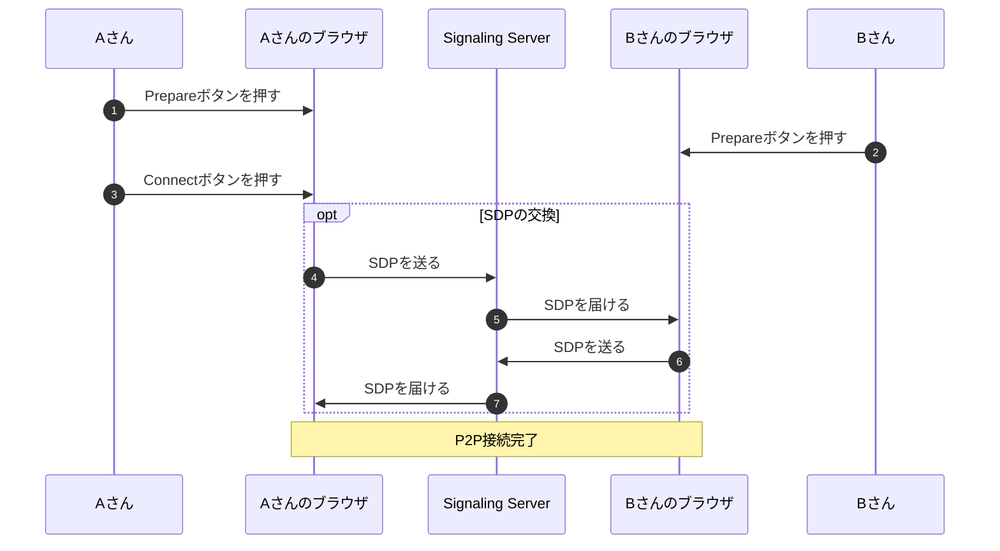
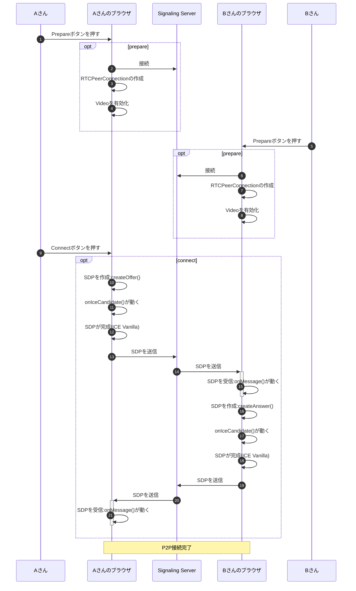

# シグナリングサーバーで繋げる

資料👉https://github.com/kurodakazumichi/youtube/tree/main/IntruductionToWebRTC/04


## 今回の内容

今まではSDPをコピペで交換してP2P通信を確立していたが、今回はいよいよ念願のシグナリングサーバーを構築してP2P通信を実現したいと思う。

また通信が繋がるまでの操作もボタンを沢山押したりめんどくさかったので今回はもっと少ない操作で繋げてみる。

※例外やエラー処理はめんどくさいので端折った


- 通信が繋がるまでの大まかな流れ
- 通信が繋がるまでの細かめの流れ
- シグナリングサーバーの実装
- クライアントサイドの実装
- シグナリングサーバーのssl対応


## AさんとBさんが繋がるまでの大まかな流れ




## AさんとBさんが繋がるまでの細かい流れ




## シグナリングサーバー

### 環境構築

```
mkdir server
cd server
yarn init -y
yarn add ws
```


### 実装

`index.js`

```js
const WebSocketServer = require('ws').Server;
const port = 3000;
const server = new WebSocketServer({port})

server.on('connection', (me) => {
  me.on('message', (msg) => {
    server.clients.forEach((client) => {
      if (me === client) {
        console.log("skip");
      } else {
        client.send(msg);
      }
    })
  })
});
```


### 実行

```
nodemon ./server/index.js
```


## クライアント

### 環境構築

```
mkdir client
cd client
```


## 実装

`index.html`

```html
<!DOCTYPE html>
<html lang="en">
<head>
  <meta charset="UTF-8">
  <meta http-equiv="X-UA-Compatible" content="IE=edge">
  <meta name="viewport" content="width=device-width, initial-scale=1.0">
  <title>クライアント</title>
</head>
<body>
  <div>
    <video id="local_video" autoplay style="width: 40%;"></video>
    <video id="remote_video" autoplay style="width: 40%;"></video>
  </div>
  <div>
    <textarea id="text_for_send_sdp" rows="5", cols="43"></textarea>
    <textarea id="text_for_recv_sdp" rows="5", cols="43"></textarea>
  </div>
  <div>
    <button onclick="prepare()">Prepare</button>
    <button onclick="connect()">Connect</button>
  </div>
  <script src="main.js"></script>
</body>
</html>
```


`main.js`

```js
//-----------------------------------------------------------------------------
// グローバル変数
//-----------------------------------------------------------------------------
const WSS_URL      = "ws://localhost:3000"; // WebSocketServerのURL
let server         = null;
let peerConnection = null;

// videoタグやtextareaなどのHTML要素
const dom = {
  videos: {
    local : document.getElementById('local_video'), // ローカル
    remote: document.getElementById('remote_video'), // ローカル
  },
  sdp: {
    send: document.getElementById("text_for_send_sdp"),
    recv: document.getElementById("text_for_recv_sdp"),
  }
};

//-----------------------------------------------------------------------------
// 関数
//-----------------------------------------------------------------------------
function prepare() {
  prepareWebSocket();
  prepareRTCPeerConnection();
  wakeupVideo();
}

function connect() {
  createOffer();
}

//-----------------------------------------------------------------------------
// WebSocket系
function prepareWebSocket() 
{
  server = new WebSocket(WSS_URL);
  server.onopen = onOpen;
  server.onerror = onError;
  server.onmessage = onMessage;
}

function onOpen(e) {
  console.log("open web socket server.");
}

function onError(e) {
  console.error(e);
}

async function onMessage(e) 
{
  const text = await e.data.text();
  const description = JSON.parse(text);

  receiveSessionDescription(description);

  if (description.type === 'offer') {
    await createAnswer();
  }
}

//-----------------------------------------------------------------------------
// PeerConnection系

// RTCPeerConnectionの準備
function prepareRTCPeerConnection() 
{
  const config = {"iceServers": []};
  peerConnection = new RTCPeerConnection(config);

  peerConnection.ontrack        = onTrack;
  peerConnection.onicecandidate = onIceCandidateVanilla;
}

// OfferのSessionDescriptionを作成・セット
async function createOffer() 
{
  const sessionDescription = await peerConnection.createOffer();
  await peerConnection.setLocalDescription(sessionDescription);
}

// AnswerのSessionDescriptionを作成・セット
async function createAnswer() 
{
  const sessionDescription = await peerConnection.createAnswer();
  await peerConnection.setLocalDescription(sessionDescription);
}

function sendSessionDescription(description) 
{
  // JSONを文字列にして送信
  const data = JSON.stringify(description);
  server.send(data);

  // textareaに表示
  dom.sdp.send.value = description.sdp;
}

async function receiveSessionDescription(description) 
{
  // コネクションに設定
  await peerConnection.setRemoteDescription(description);

  // textareに表示
  dom.sdp.recv.value = description.sdp;
}

function onTrack(e) {
  let stream = e.streams[0];
  playVideo(dom.videos.remote, stream);
}

function onIceCandidateVanilla (e) 
{
  // ICEの収集完了を待つ
  if (e.candidate !== null) return;

  // SDPの情報をシグナリングサーバーへ
  const description = peerConnection.localDescription;
  sendSessionDescription(description);
}

//-----------------------------------------------------------------------------
// カメラ関係
async function wakeupVideo() 
{
  const config = {video:true, audio:false};

  const stream = await navigator.mediaDevices.getUserMedia(config);

  stream.getTracks().forEach((track) => {
    peerConnection.addTrack(track, stream);
  })

  playVideo(dom.videos.local, stream);
}

function playVideo(element, stream) 
{
  element.srcObject = stream;
  element.play();
  element.volume = 0;
}
```


### 実行

```
http-server -c-1 ./client --ssl --key ./ssl/server.key --cert ./ssl/server.crt
```


## シグナリングサーバのssl対応

### 実装

```js
const https = require('https');
const fs = require('fs');
const WebSocketServer = require('ws').Server;
const port = 3000;

const server = https.createServer({
  key: fs.readFileSync(__dirname + '/../ssl/server.key'),
  cert: fs.readFileSync(__dirname + '/../ssl/server.crt'),
})

const wssServer = new WebSocketServer({server});
server.listen(port);

wssServer.on('connection', (me) => {
  me.on('message', (msg) => {
    wssServer.clients.forEach((client) => {
      if (me === client) {
        console.log("skip");
      } else {
        client.send(msg);
      }
    })
  })
});
```


### 実行

```
nodemon ./server/index.js
```


### トラブルシューティング

#### `wscat`で`error: self signed certificate`がでる

結論からいうと、`wscat`コマンドの末尾に`--no-check`というオプションを指定すれば解決する。

- ssl化したWebSocketServerに`wscat`で接続をしたら`error: self signed certificate`というエラーが表示された。

- 今回用意したサーバー証明書は自分で作って自分で署名したなんちゃってSSLなので、どうやらそれが原因でエラーになっているらしい。

  

**以下は試してみたけど結果としてうまくいかなった失敗談**

以下のコマンドを叩き、yarnの設定を表示する：

```
yarn config list
```

ドバッっと設定が表示されるがその中に以下の1行がある(はず)

```
'strict-ssl': true,
```

この設定が`true`だとなんちゃってSSLのサーバーに接続するようなコマンドとかを叩くとエラーになる(っぽい)


以下のコマンドで設定を無効にすればいける。

```
yarn config set strict-ssl false
```

と思いきや**ダメでした**


とりあえず元に戻しておく

```
yarn config set strict-ssl true
```


### クライアント側の修正

WebSocketServerのURLを`ws`から`wss`に変更するのみ

```diff
- const WSS_URL      = "ws://localhost:3000"; // WebSocketServerのURL
+ const WSS_URL      = "wss://localhost:3000"; // WebSocketServerのURL
```

同一マシン上であればURLは`localhost`でも構わないが、同一LAN内の異なるマシンと通信する場合は`localhost`ではダメなので、`ws://192.168.xxx.xxx`などローカルIPで指定すること。


### 課題

今回の実装では1:1の通信しか実現できず、複数人で集まったりはできないということ。


## 参考

- [yarnで Error: self signed certificate in certificate chain と認証エラーが発生したら](https://qiita.com/naru0504/items/06b687d6a174286756da)
- [WebRTC P2Pを使って２つのマシンを接続する](https://moewe-net.com/webrtc/p2p-single)
- [Node.jsのwscatでerror: self signed cetificateが発生する。](https://kobe-systemdesign.work/2021/08/24/node-js%E3%81%AEwscat%E3%81%A7error-self-signed-cetificate%E3%81%8C%E7%99%BA%E7%94%9F%E3%81%99%E3%82%8B%E3%80%82/)
