# シグナリングサーバーで繋げる

資料👉https://github.com/kurodakazumichi/youtube/tree/main/IntruductionToWebRTC/04


## 今回の内容

今まではSDPをコピペで交換してP2P通信を確立していたが、今回はいよいよ念願のシグナリングサーバーを構築してP2P通信を実現したいと思う。

また通信が繋がるまでの操作もボタンを沢山押したりめんどくさかったので今回はもっと少ない操作で繋げてみる。

※例外やエラー処理はめんどくさいので端折った


- 通信が繋がるまでの大まかな流れ
- 通信が繋がるまでの細かめの流れ
- シグナリングサーバーの実装
- クライアントサイドの実装
- シグナリングサーバーのssl対応


## AさんとBさんが繋がるまでの大まかな流れ

```mermaid
sequenceDiagram
	autonumber
	participant A as Aさん
	participant ClientA as Aさんのブラウザ
	participant Server as Signaling Server
	participant ClientB as Bさんのブラウザ
	participant B as Bさん
	
	A->>ClientA: Prepareボタンを押す
	B->>ClientB: Prepareボタンを押す
	A->>ClientA: Connectボタンを押す
	
	opt SDPの交換
	ClientA->>Server:SDPを送る
	Server->>ClientB: SDPを届ける
	ClientB->>Server: SDPを送る
	Server->>ClientA: SDPを届ける
	end
	
	Note over ClientA,ClientB: P2P接続完了
```




## AさんとBさんが繋がるまでの細かい流れ

```mermaid
sequenceDiagram
	autonumber
	participant A as Aさん
	participant ClientA as Aさんのブラウザ
	participant Server as Signaling Server
	participant ClientB as Bさんのブラウザ
	participant B as Bさん
	
	A->>ClientA: Prepareボタンを押す
	
	opt prepare
        ClientA->>Server: 接続
        ClientA->>ClientA: RTCPeerConnectionの作成
        ClientA->>ClientA: Videoを有効化
	end
	
	B->>ClientB: Prepareボタンを押す
	opt prepare
        ClientB->>Server: 接続
        ClientB->>ClientB: RTCPeerConnectionの作成
        ClientB->>ClientB: Videoを有効化
	end
    
	A->>ClientA: Connectボタンを押す
	opt connect
        ClientA->>ClientA: SDPを作成:createOffer()
        ClientA->>ClientA: onIceCandidate()が動く
        ClientA->>ClientA: SDPが完成(ICE Vanilla)
        
        ClientA->>Server: SDPを送信
        
        Server->>+ClientB: SDPを送信
        ClientB->>-ClientB: SDPを受信:onMessage()が動く
        
        ClientB->>ClientB: SDPを作成:createAnswer()
        ClientB->>ClientB: onIceCandidate()が動く
        ClientB->>ClientB: SDPが完成(ICE Vanilla)
        ClientB->>Server: SDPを送信
        
        Server->>+ClientA: SDPを送信
        ClientA->>-ClientA: SDPを受信:onMessage()が動く
	end
	
	
	Note over ClientA,ClientB: P2P接続完了
```




## シグナリングサーバー

### 環境構築

```
mkdir server
cd server
yarn init -y
yarn add ws
```


### 実装

`index.js`

```js
const WebSocketServer = require('ws').Server;
const port = 3000;
const server = new WebSocketServer({port})

server.on('connection', (me) => {
  me.on('message', (msg) => {
    server.clients.forEach((client) => {
      if (me === client) {
        console.log("skip");
      } else {
        client.send(msg);
      }
    })
  })
});
```


### 実行

```
nodemon ./server/index.js
```


## クライアント

### 環境構築

```
mkdir client
cd client
```


## 実装

`index.html`

```html
<!DOCTYPE html>
<html lang="en">
<head>
  <meta charset="UTF-8">
  <meta http-equiv="X-UA-Compatible" content="IE=edge">
  <meta name="viewport" content="width=device-width, initial-scale=1.0">
  <title>クライアント</title>
</head>
<body>
  <div>
    <video id="local_video" autoplay style="width: 40%;"></video>
    <video id="remote_video" autoplay style="width: 40%;"></video>
  </div>
  <div>
    <textarea id="text_for_send_sdp" rows="5", cols="43"></textarea>
    <textarea id="text_for_recv_sdp" rows="5", cols="43"></textarea>
  </div>
  <div>
    <button onclick="prepare()">Prepare</button>
    <button onclick="connect()">Connect</button>
  </div>
  <script src="main.js"></script>
</body>
</html>
```


`main.js`

```js
//-----------------------------------------------------------------------------
// グローバル変数
//-----------------------------------------------------------------------------
const WSS_URL      = "ws://localhost:3000"; // WebSocketServerのURL
let server         = null;
let peerConnection = null;

// videoタグやtextareaなどのHTML要素
const dom = {
  videos: {
    local : document.getElementById('local_video'), // ローカル
    remote: document.getElementById('remote_video'), // ローカル
  },
  sdp: {
    send: document.getElementById("text_for_send_sdp"),
    recv: document.getElementById("text_for_recv_sdp"),
  }
};

//-----------------------------------------------------------------------------
// 関数
//-----------------------------------------------------------------------------
function prepare() {
  prepareWebSocket();
  prepareRTCPeerConnection();
  wakeupVideo();
}

function connect() {
  createOffer();
}

//-----------------------------------------------------------------------------
// WebSocket系
function prepareWebSocket() 
{
  server = new WebSocket(WSS_URL);
  server.onopen = onOpen;
  server.onerror = onError;
  server.onmessage = onMessage;
}

function onOpen(e) {
  console.log("open web socket server.");
}

function onError(e) {
  console.error(e);
}

async function onMessage(e) 
{
  const text = await e.data.text();
  const msg = JSON.parse(text);

  if (msg.type === 'offer') {
    receiveSessionDescription(msg);
    await createAnswer();
    return;
  }

  if (msg.type === 'answer') {
    receiveSessionDescription(msg);
    return;
  }
}

//-----------------------------------------------------------------------------
// PeerConnection系

// RTCPeerConnectionの準備
function prepareRTCPeerConnection() 
{
  const config = {"iceServers": []};
  peerConnection = new RTCPeerConnection(config);

  peerConnection.ontrack        = onTrack;
  peerConnection.onicecandidate = onIceCandidate;
}

// OfferのSessionDescriptionを作成・セット
async function createOffer() 
{
  const sessionDescription = await peerConnection.createOffer();
  await peerConnection.setLocalDescription(sessionDescription);
}

// AnswerのSessionDescriptionを作成・セット
async function createAnswer() 
{
  const sessionDescription = await peerConnection.createAnswer();
  await peerConnection.setLocalDescription(sessionDescription);
}

function sendSessionDescription(description) 
{
  // JSONを文字列にして送信
  const data = JSON.stringify(description);
  server.send(data);

  // textareaに表示
  dom.sdp.send.value = description.sdp;
}

async function receiveSessionDescription(description) 
{
  // コネクションに設定
  await peerConnection.setRemoteDescription(description);

  // textareに表示
  dom.sdp.recv.value = description.sdp;
}

function onTrack(e) {
  let stream = e.streams[0];
  playVideo(dom.videos.remote, stream);
}

function onIceCandidate (e) 
{
  console.log("onicecandidate");
  
  // ICEの収集完了を待つ
  if (e.candidate !== null) return;

  // SDPの情報をシグナリングサーバーへ
  const description = peerConnection.localDescription;
  sendSessionDescription(description);
}

//-----------------------------------------------------------------------------
// カメラ関係
async function wakeupVideo() 
{
  const config = {video:true, audio:false};

  const stream = await navigator.mediaDevices.getUserMedia(config);

  stream.getTracks().forEach((track) => {
    peerConnection.addTrack(track, stream);
  })

  playVideo(dom.videos.local, stream);
}

function playVideo(element, stream) 
{
  element.srcObject = stream;
  element.play();
  element.volume = 0;
}
```


### 実行

```
http-server -c-1 ./client --ssl --key ./ssl/server.key --cert ./ssl/server.crt
```


## シグナリングサーバのssl対応

### 実装

```js
const https = require('https');
const fs = require('fs');
const WebSocketServer = require('ws').Server;
const port = 3000;

const server = https.createServer({
  key: fs.readFileSync(__dirname + '/../ssl/server.key'),
  cert: fs.readFileSync(__dirname + '/../ssl/server.crt'),
})

const wssServer = new WebSocketServer({server});
server.listen(port);

wssServer.on('connection', (me) => {
  me.on('message', (msg) => {
    wssServer.clients.forEach((client) => {
      if (me === client) {
        console.log("skip");
      } else {
        client.send(msg);
      }
    })
  })
});
```


### 実行

```
nodemon ./server/index.js
```


### トラブルシューティング

#### `wscat`で`error: self signed certificate`がでる

結論からいうと、`wscat`コマンドの末尾に`--no-check`というオプションを指定すれば解決する。

- ssl化したWebSocketServerに`wscat`で接続をしたら`error: self signed certificate`というエラーが表示された。

- 今回用意したサーバー証明書は自分で作って自分で署名したなんちゃってSSLなので、どうやらそれが原因でエラーになっているらしい。

  

**以下は試してみたけど結果としてうまくいかなった失敗談**

以下のコマンドを叩き、yarnの設定を表示する：

```
yarn config list
```

ドバッっと設定が表示されるがその中に以下の1行がある(はず)

```
'strict-ssl': true,
```

この設定が`true`だとなんちゃってSSLのサーバーに接続するようなコマンドとかを叩くとエラーになる(っぽい)


以下のコマンドで設定を無効にすればいける。

```
yarn config set strict-ssl false
```

と思いきや**ダメでした**


とりあえず元に戻しておく

```
yarn config set strict-ssl true
```


### クライアント側の修正

WebSocketServerのURLを`ws`から`wss`に変更するのみ

```diff
- const WSS_URL      = "ws://localhost:3000"; // WebSocketServerのURL
+ const WSS_URL      = "wss://localhost:3000"; // WebSocketServerのURL
```

同一マシン上であればURLは`localhost`でも構わないが、同一LAN内の異なるマシンと通信する場合は`localhost`ではダメなので、`ws://192.168.xxx.xxx`などローカルIPで指定すること。


## ICE Trickleにしてみる

上記の実装はICE Candidateが集まるのを待って通信をするので`ICE Vanilla`である、この実装を`ICE Candidate`が見つかるたびに交換しあう、`ICE Trickle`に変更してみる。

```mermaid
sequenceDiagram
	autonumber
	participant A as Aさん
	participant ClientA as Aさんのブラウザ
	participant Server as Signaling Server
	participant ClientB as Bさんのブラウザ
	participant B as Bさん
	
	A->>ClientA: Connectボタンを押す
	opt connect
        ClientA->>ClientA: SDPを作成:createOffer()
        ClientA->>Server: SDPを送信
        Server->>+ClientB: 
        
        ClientB->>-ClientB: SDPを受信:onMessage()が動く
        
        ClientB->>ClientB: SDPを作成:createAnswer()
        ClientB->>Server: SDPを送信
        Server->>+ClientA: 
        
        ClientA->>-ClientA: SDPを受信:onMessage()が動く
        
        ClientA->>Server: ICE Candidateを送信
        Server->>ClientB: 
        
        ClientB->>Server: ICE Candidateを送信
        Server->>ClientA: 
        
        
	end
	
	
	Note over ClientA,ClientB: P2P接続完了
```





### 変更点１

最初にSDPの情報を作った時点で相手に送信するようにする。

```diff
// OfferのSessionDescriptionを作成・セット
async function createOffer() 
{
  const sessionDescription = await peerConnection.createOffer();
  await peerConnection.setLocalDescription(sessionDescription);
+  sendSessionDescription(sessionDescription);
}

// AnswerのSessionDescriptionを作成・セット
async function createAnswer() 
{
  const sessionDescription = await peerConnection.createAnswer();
  await peerConnection.setLocalDescription(sessionDescription);
+  sendSessionDescription(sessionDescription);
}
```


### 変更点2

`onIceCandidate(e)`の処理を変更する

**変更前**

```js
function onIceCandidate (e) 
{
  // ICEの収集完了を待つ
  if (e.candidate !== null) return;

  // SDPの情報をシグナリングサーバーへ
  const description = peerConnection.localDescription;
  sendSessionDescription(description);
}
```

**変更後**

```js
function onIceCandidate (e) 
{
  // candidateがなければ何もしない
  if (e.candidate === null) return;

  // 候補を送信
  const data = {
    type: "candidate",
    ice: e.candidate
  };
  server.send(JSON.stringify(data));
}
```


### 変更点3

WebSocketServerから`candidate`が届いたら、それをコネクションに登録する。

```diff
async function onMessage(e) 
{
  const text = await e.data.text();
  const msg = JSON.parse(text);

  if (msg.type === 'offer') {
    receiveSessionDescription(msg);
    await createAnswer();
    return;
  }

  if (msg.type === 'answer') {
    receiveSessionDescription(msg);
    return;
  }

+  if (msg.type === 'candidate') {
+    const candidate = new RTCIceCandidate(msg.ice);
+    peerConnection.addIceCandidate(candidate);
+  }
}
```


## 課題

今回の実装では1:1の通信しか実現できず、複数人で集まったりはできないということ。


## 参考

- [yarnで Error: self signed certificate in certificate chain と認証エラーが発生したら](https://qiita.com/naru0504/items/06b687d6a174286756da)
- [WebRTC P2Pを使って２つのマシンを接続する](https://moewe-net.com/webrtc/p2p-single)
- [Node.jsのwscatでerror: self signed cetificateが発生する。](https://kobe-systemdesign.work/2021/08/24/node-js%E3%81%AEwscat%E3%81%A7error-self-signed-cetificate%E3%81%8C%E7%99%BA%E7%94%9F%E3%81%99%E3%82%8B%E3%80%82/)
