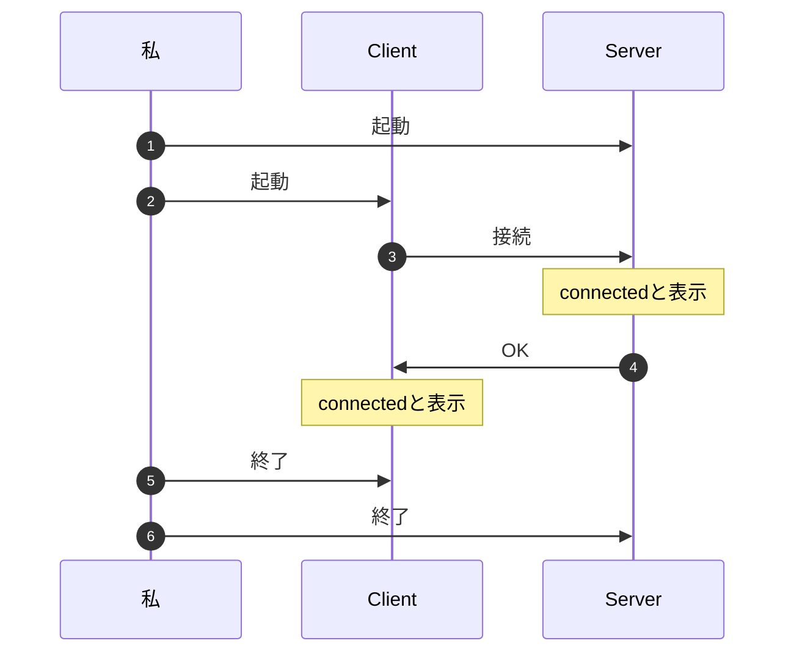

# 002 Socket.IOの導入と動作確認

## この動画でやること

Node.js環境でSocket.IOを使ったサーバー、クライアントを実装して動かしてみる。

サーバー、クライアントが繋がったら‘connected`と表示するだけ、特にやりとりもしない、ほんと動かすだけ。



## 今後の流れ

- 環境構築
- Server Sideの実装
- Client Sideの実装
- まとめ


## 環境構築

サーバー用のライブラリ、`socket.io`とクライアント側のライブラリ、`socket.io-client`を追加

```
yarn init -y
yarn add socket.io socket.io-client
```


## Server Side

### 実装

`server.js`

```js
const { Server } = require('socket.io');
const io = new Server(3000);
console.log("Serverが起動しました")

io.on("connection", (socket) => {
  console.log("connected");
})
```


### 実行

`node server.js`


## Client Side

### 実装

`client.js`

```js
const { io } = require('socket.io-client');
const socket = io("http://localhost:3000");

socket.on("connect", () => {
  console.log("connected");
})
```


### 実行

```
node client.js
```


## まとめ

- サーバー側もhttpsにしたりexpressと組み合わせたりなどいろんな実装があるようで、そこらへんは公式の[Server Initialization](https://socket.io/docs/v4/server-initialization/)を見れば良さそう
- クライアント側も今回はNode.jsで実装したけど、ブラウザ上のJavaScriptでもできるし、そこらへんは公式の[Client Initialization](https://socket.io/docs/v4/client-initialization/)を見れば良さそう

何もしてないけど、とりあえず導入と動作確認ができたのでヨシッ
