# 003 Socket.IOを使ってチャットを作る

## この動画でやること

この動画ではSocket.IOを使ってチャットを実装する。

- **ステップ1**：コマンドラインで動作するチャットの実装
- **ステップ2**：ブラウザで動作するチャットの実装


## 今後の流れ

- Socketについて
- 環境構築
- コマンドライン版チャットの実装
  - サーバーとクライアントの準備
  - サーバーにメッセージを送る
  - サーバーはクライアントから届いたメッセージを全員に届ける
  - サーバーから届いたメッセージを表示する
  - サーバーに誰かが接続してきたら通知をだす
  - クライアントとの接続が切れたら通知を出す
  - 自分以外のチャットメッセージだけを表示する
  - 送信者の名前を表示する
  - おまけ：文字の表示色を変える
- ブラウザ版の実装


## Socketについて

プログラムの中でたびたび登場するSocketについて雰囲気をつかんでおく。


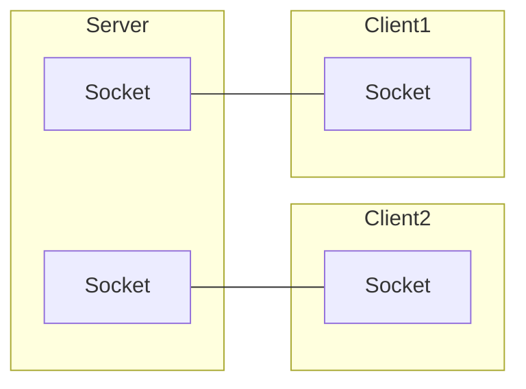

- Socketはクライアントの数だけ必要
- クライアントが2人いれば、サーバーには2人分のSocketが存在し、それぞれがクライアントと繋がっているイメージ


**以下は間違ったイメージ**

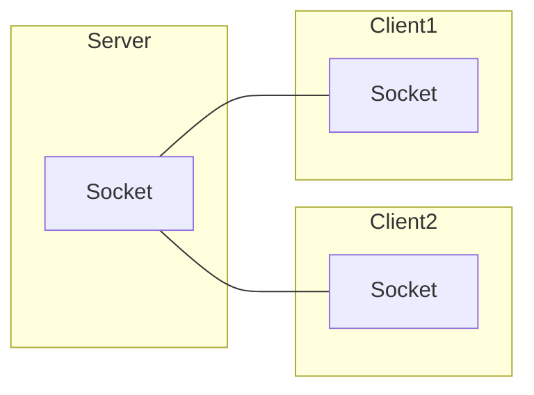

Socketは原則として1:1の関係であり、上記のように1:多ではない。


## 環境構築

```
yarn init -y
yarn add socket.io socket.io-client
```


## サーバーとクライアントの準備

[Socket.IO勉強動画 第2回](https://youtu.be/j7sM_zup9sE)でやったのと同じなので、詳しくはそちらを参照してね

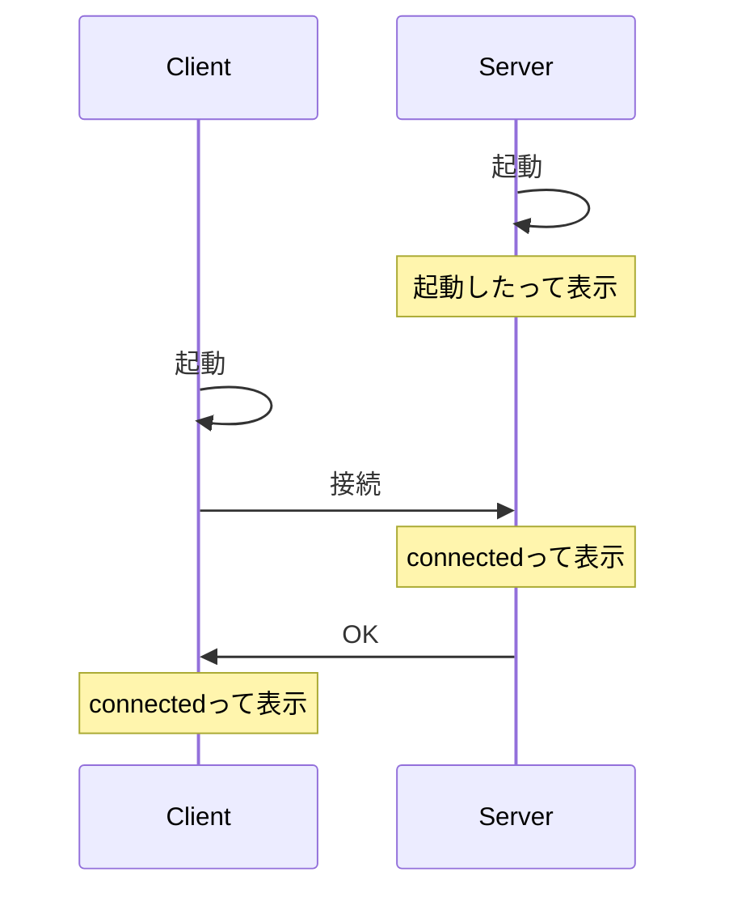


`server.js`

```js
const { Server } = require('socket.io');
const io = new Server(3000);
console.log("サーバーが起動しました");

io.on("connection", (socket) => {
  console.log("connected");
})
```


`client.js`

```js
const io = require("socket.io-client");

// Socket.IOサーバーに接続
const socket = io("http://localhost:3000");

// 繋がった
socket.on("connect", () => {
  console.log("connected");
})
```


## サーバーにメッセージを送る

クライアントが入力したメッセージをサーバーへ送信する処理の実装

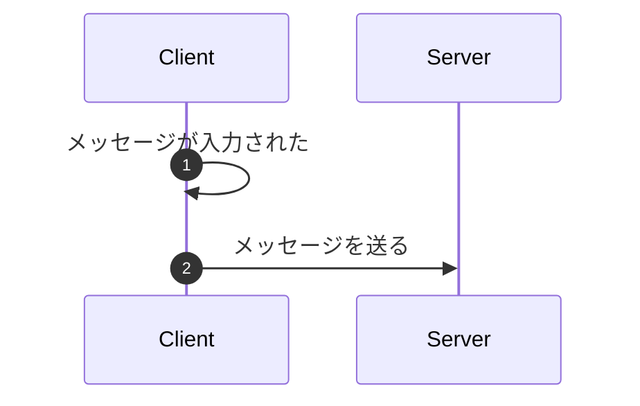

- メッセージの入力は標準入力を使う👉まず標準入力から文字を受け取る部分を作る
- メッセージをサーバーに送信する場合、`socket.emit(イベント名, メッセージ)`を使う


### 標準入力から入力された文字を受け取る部分

`client.js`

```js
// 標準入力の準備
process.stdin.setEncoding("utf8");
const reader = require('readline').createInterface({
  input: process.stdin
});

// 文字が入力されたときの処理
read.on("line", (input) => {
  console.log(input);
})
```


### 入力された文字をサーバーへ送信する

`client.js`

```diff
reader.on("line", (input) => {
-  console.log(input);
+  socket.emit("chat", input);
})
```


## サーバーはクライアントから届いたメッセージを全員に届ける

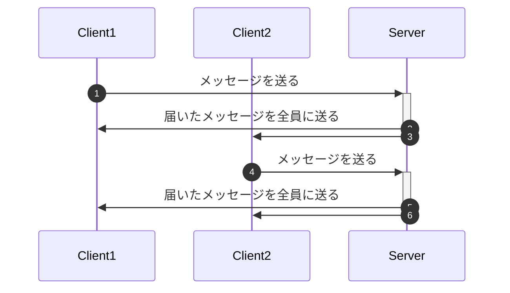

- メッセージが届いた時は`socket.on(イベント名, コールバック)`を使う
- 全員にメッセージを送りたい時は`io.emit(イベント名, メッセージ)`を使う


`server.js`

```js
io.on("connection", (socket) => {
  console.log("connected");
})
```

この`console.log`の部分を以下のように変更

```js
io.on("connection", (socket) => {
  // チャットメッセージが届いたら全員に展開
  socket.on('chat', (msg) => {
    console.log(msg);
    io.emit('chat', msg);
  })  
})
```

- クライアント側でメッセージは`chat`と言う名前のイベントで送った場合、サーバー側も`chat`という名前でイベントを受け取ることができる。
- このイベント名は基本的には自由に付けられる。


## サーバーから届いたメッセージを表示する

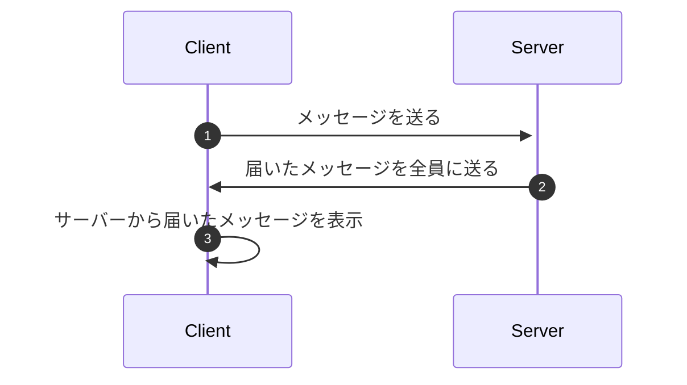

- メッセージが届いた時は`socket.on(イベント名, コールバック)`を使う、サーバー側と書き方は同じ

- サーバーからは`chat`というイベント名でメッセージが送られてくるので、クライアント側も`chat`というイベントで待ち受ける

  

`clietnt.js`

```js
// チャットメッセージを受信
socket.on("chat", (msg) => {
  console.log(msg);
})
```

- **この時点で一応チャットはできる**、クライアントを2人用意して試してみると良き
- 以降は機能を充実させていく


## サーバーに誰かが接続してきたら通知を出す

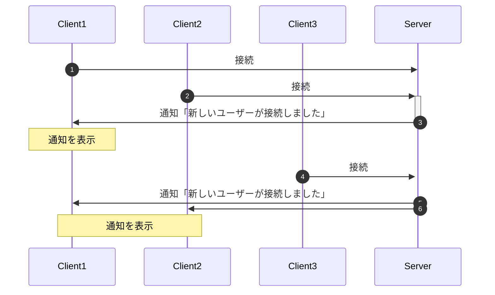

- 接続してきた本人以外に通知を出すときは、`socket.broadcast.emit(イベント名, メッセ維持)`を使う

### server.js

- 接続があった時に通知を送る処理を追加

```js
io.on("connection", (socket) => 
{
  // サーバーに接続したら、本人以外にお知らせ
  socket.broadcast.emit("info", "新しいユーザーが接続しました。");
    
  // その他処理...
}
```


### client.js

- 通知が届いた時の処理を追加

```js
// お知らせメッセージを受信
socket.on("info", (msg) => {
  console.log(msg);
})
```


## クライアントとの接続が切れたら通知を出す

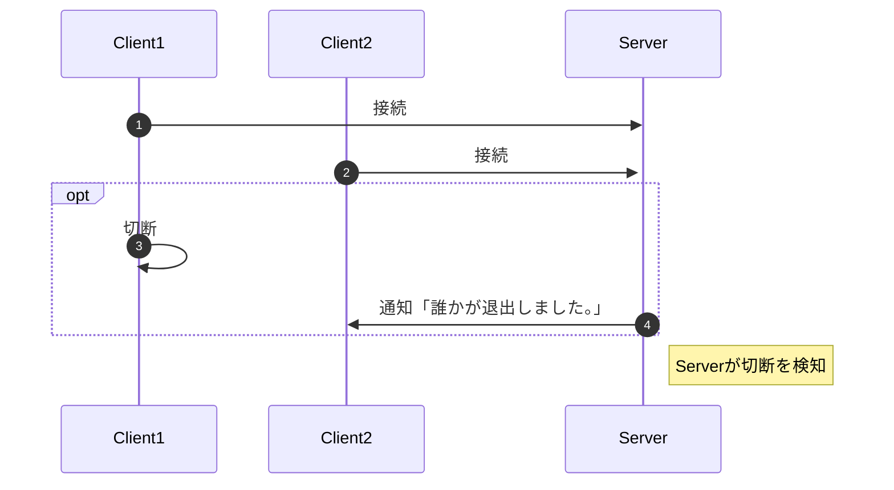

`server.js`

- `socket`に切断されたときのイベントを設定しておく、何らかでクライアントの接続が切れた場合に動作する
- 誰かが退室した旨のメッセージを`info`で送る

```js
// クライアントとの通信が切断したとき
socket.on('disconnect', () => {
  io.emit("info", "誰かが退出しました。");
})
```

※`client.js`は`info`が届いたら表示する処理を既に実装しているので特にやることなし


## 自分以外のチャットメッセージだけ表示する

今は自分が送ったメッセージが自分にも表示されるので、他のユーザーから届いたメッセージだけ表示するように修正していく


### どうやって判断するのか？

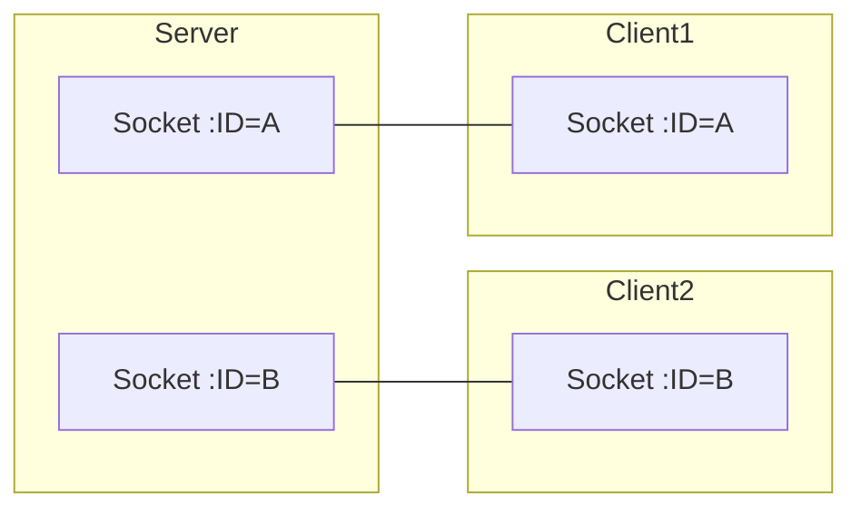

- サーバーとクライアントは`socket`を介して通信をしており、`Socket.IO`ではこの`socket`に一意のIDが割り当てられている
- IDを上手く使うことで相手を区別する事ができる


### SocketIDを確かめる

#### server.js

- クライアント接続時にそのソケットのIDを表示してみる

```js
// ソケットIDを表示する
console.log(`connected: socket.id = ${socket.id}`);
```

- クライアント切断時にもソケットのIDを表示してみる

```js
// クライアントとの通信が切断したとき
socket.on('disconnect', () => {
  console.log(`disconnect: socket.id = ${socket.id}`);
  io.emit("info", "誰かが退出しました。");
})
```


#### client.js

- ソケット生成時にソケットのIDを確認してみる

```js
// ソケットIDを表示する
console.log(`socket.id = ${socket.id}`);
```

- 接続完了時にソケットIDを確認してみる

```diff
// 繋がった
socket.on("connect", () => {
-  console.log("connected");
+  console.log(`connected: socket.id = ${socket.id}`);
})
```


#### クライアントとサーバーでSocketIDが共有される流れ(想像)

以下はSocketIDのやり取りのイメージ、Socket.IOライブラリが自動的にやってくれているようだ

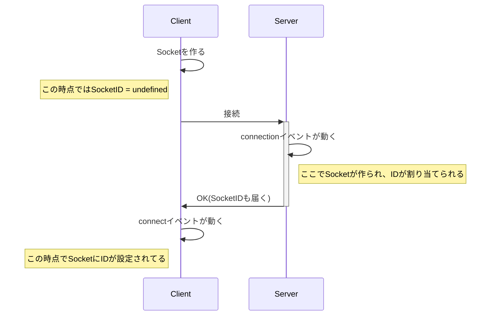


### チャットメッセージにSocketIDを含める

#### やりたいこと：

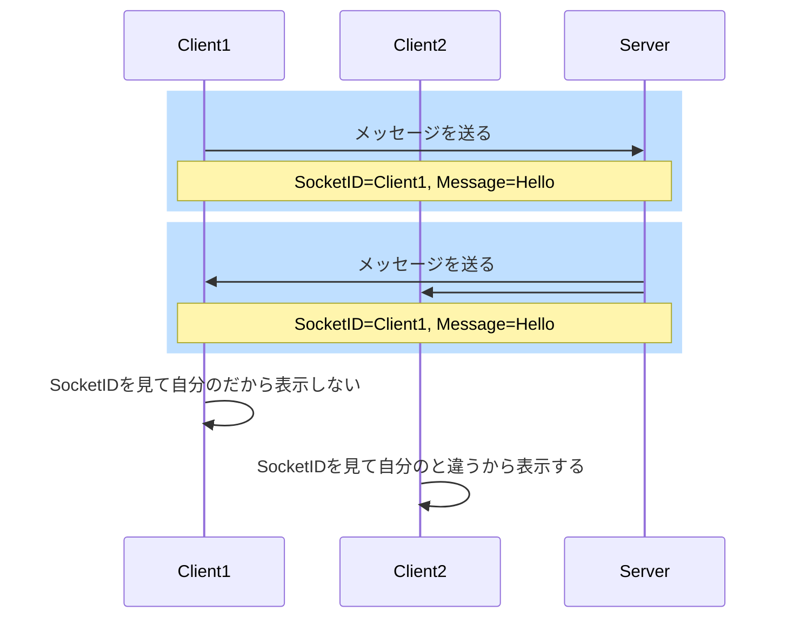


- 誰のメッセージかという情報を判断するために、送信するチャットメッセージにSocketIDも含める(
  - Socket.IOはテキストだけでなく、JSONデータも簡単に送る事ができる
- クライアント側でメッセージに含まれるSocketIDを見て、表示するかどうかを決める
- 修正は`client.js`のみ


#### client.js

自分の情報を保持するグローバル変数`IAM`を用意する

```js
// 自分の情報
const IAM = {
  id : undefined
};
```


サーバーと繋がった際にSocketIDを保存(わざわざ保存しなくてもいいけど)

```diff
// 繋がった
socket.on("connect", () => {
  console.log(`connected: socket.id = ${socket.id}`);
+ IAM.id = socket.id;
})
```


メッセージを送る際にSocketIDを含めるように修正 (生のSocketIDをそのまま使うのはセキュリティ的に良くないかもだが今は気にしない事にする)

```diff
// 文字が入力されたときの処理
reader.on("line", (input) => {
+ const msg = {
+   id  : IAM.id,
+   text: input,
+ };

-  socket.emit("chat", input);
+  socket.emit("chat", msg);
})
```


メッセージを受信したときにSocketIDを見て表示するかどうか決める

```diff
// チャットメッセージを受信
socket.on("chat", (msg) => {
+ if (msg.id === IAM.id) return;
- console.log(msg);
+ console.log(msg.text);
})
```


## 送信者の名前を表示する

今は誰からメッセージが送られてきたのかわからないので、クライアントに名前を設定してメッセージを表示するときに、送信者の名前も表示するようにする。

- 名前は`client.js`を起動するときに、コマンドライン引数で指定する
- メッセージを送る際に名前も一緒に送る
- 表示する時に名前も付けて表示する
- 修正は`client.js`のみ


### コマンドライン引数から名前を取得

- コマンドライン引数は`process.argv`に入っている
- `process.argv`は配列になっている
- `process.argv`はデフォルトで`node.exe`のあるパスと、カレントディレクトリのパスの2つの要素が入っている
- コマンドラインで指定した引数は`process.argv[2]`に入っている

```js
// 名前を設定
const NAME = process.argv[2];

// 自分の情報
const IAM = {
  id  : undefined,
  name: NAME,      // ←追加
};
```


### 送信するデータに名前を含める

```diff
// 文字が入力されたときの処理
reader.on("line", (input) => {
  const msg = {
    id  : IAM.id,
+   name: IAM.name,
    text: input,
  };
  socket.emit("chat", msg);
})
```


### メッセージ表示する際に名前も表示する

```diff
// チャットメッセージを受信
socket.on("chat", (msg) => {
  if (msg.id === IAM.id) return;
- console.log(msg.text);
+ console.log(`${msg.name}:${msg.text}`);
})
```


## おまけ：文字の表示色を変える

お知らせのメッセージは青、受信したチャットメッセージは黄色の文字で表示してみる


- ターミナルの文字色は制御文字という特定の文字列を使う事で変更できる
- 例えば`\u001b[34m`という制御文字の後に表示される文字列は青色になる
  - `console.log("\u001b[34m Hello World")`とすると`Hello World`が青で表示される
- この制御文字は環境によっては動作しないこともあるが、ある程度は動作するはずである
- 修正は`client.js`のみ


### 文字表示用の関数を用意する

- 用意するのは以下の2種類とする
  - 通知用の`show.info(text)`
  - チャット用の`show.chat(text)`

```js
// テキストの表示を少しオシャレにする
// 制御文字(control charactor)の定義、ターミナルの文字色を変えたりする
const cc = {
  blue  : "\u001b[34m",
  yellow: "\u001b[33m",
  reset : "\u001b[0m",
}

const show = 
{
  info: (text) => {
    const msg = "info: " + text;
    console.log(`${cc.blue}${msg}${cc.reset}`);
  },
  chat: (text) => {
    const msg = "> " + text;
    console.log(`${cc.yellow}${msg}${cc.reset}`);
  }
}
```


### console.logを置き換える

```diff
// チャットメッセージを受信
socket.on("chat", (msg) => {
  if (msg.id === IAM.id) return;
- console.log(`${msg.name}:${msg.text}`);  
+ show.chat(`${msg.name}:${msg.text}`);
})

// お知らせメッセージを受信
socket.on("info", (msg) => {
- console.log(msg);
+ show.info(msg);
})
```


## ブラウザ版の実装

今まではコマンドラインでやってきたが、ブラウザ版のチャットクライアントを実装してみる。

- UIはこだわらず、必要最低限の修正で終わらせる
- Webサーバーは`http-server`を利用する


### 環境構築

- `browser`というディレクトリを用意し、`index.html`、`main.js`を用意する
- HTMLは名前、メッセージ入力欄、送信ボタンのみ
- 処理は全て`main.js`に記載する

```
mkdir browser
cd browser
touch index.html main.js
```


#### index.html

```html
<!DOCTYPE html>
<html lang="ja">
<head>
  <meta charset="UTF-8">
  <meta http-equiv="X-UA-Compatible" content="IE=edge">
  <meta name="viewport" content="width=device-width, initial-scale=1.0">
  <title>Chat</title>
  <script src="http://localhost:3000/socket.io/socket.io.js"></script>
</head>
<body>
  <span id="name"></span>：<input id="message"><button onclick="send()">送信</button>
  <script src="main.js"></script>
</body>
</html>
```


- `socket.io-client`のソースコードが必要なので`http://localhost:3000/socket.io/socket.io.js`を読み込む
  - 実はSocket.IOでサーバーを立ち上げると、`/socket.io/socket.io.js`というURLにアクセスするだけでクライアント側に必要な`js`ファイルが取得できるようになっている
  - これはSocket.IOのデフォルトの機能で、プログラムで`js`ファイルを提供しないようにすることもできる
- 名前、入力欄、ボタンを用意
- ボタンを押したら`send()`を呼ぶ
- `main.js`を読み込む


### main.js

とりあえず`client.js`の内容をコピペでもってくる、このままでは動かないのでブラウザに合わせて修正していく。


#### `client.js`の内容を`main.js`にコピペ (以下にソースコード全文も載せておく)

```js
// 名前を設定
const NAME = process.argv[2];

// 自分の情報
const IAM = {
  id  : undefined,
  name: NAME,
};

const io = require("socket.io-client");

// Socket.IOサーバーに接続
const socket = io("http://localhost:3000");

// ソケットIDを表示する
console.log(`socket.id = ${socket.id}`);

// 繋がった
socket.on("connect", () => {
  console.log(`connected: socket.id = ${socket.id}`);
  IAM.id = socket.id;
})

// 標準入力の準備
process.stdin.setEncoding("utf8");
const reader = require('readline').createInterface({
  input: process.stdin
});

// 文字が入力されたときの処理
reader.on("line", (input) => {
  const msg = {
    id  : IAM.id,
    name: IAM.name,
    text: input,
  };
  socket.emit("chat", msg);
})

// チャットメッセージを受信
socket.on("chat", (msg) => {
  if (msg.id === IAM.id) return;
  show.chat(`${msg.name}:${msg.text}`);
})

// お知らせメッセージを受信
socket.on("info", (msg) => {
  show.info(msg);
})

// テキストの表示を少しオシャレにする
// 制御文字(control charactor)の定義、ターミナルの文字色を変えたりする
const cc = {
  blue  : "\u001b[34m",
  yellow: "\u001b[33m",
  reset : "\u001b[0m",
}

const show = 
{
  info: (text) => {
    const msg = "info: " + text;
    console.log(`${cc.blue}${msg}${cc.reset}`);
  },
  chat: (text) => {
    const msg = "> " + text;
    console.log(`${cc.yellow}${msg}${cc.reset}`);
  }
}
```


#### DOMの取得

操作する必要のある`DOM`を取得しておく

```js
// DOMの取得
const dom = {
  name    : document.getElementById('name'),
  message : document.getElementById('message'),
}
```


#### 名前を決める

- ブラウザにコマンドライン引数はないので、`prompt()`で名前を入力させることにする
- 名前が入力されたらブラウザに表示

```diff
// 名前を設定
- const NAME = process.argv[2];
+ const NAME = prompt("名前を入力してください。");
+ dom.name.innerText = NAME;
```


#### requireを削除

HTML側で読み込んでいるし、ブラウザでは動かない

```diff
- const io = require("socket.io-client");
```


#### 標準入力の処理を削除

ブラウザでは動かないし、入力欄を用意したので不要

```diff
- // 標準入力の準備
- process.stdin.setEncoding("utf8");
- const reader = require('readline').createInterface({
-   input: process.stdin
- });
```


### メッセージ送信処理の修正

- 送信ボタンが押されたら`send()`が呼ばれるので、`send()`関数を定義する
- 処理は標準入力に文字が入力されたときの処理を少し変えるだけ

以下の処理を

```js
// 文字が入力されたときの処理
reader.on("line", (input) => {
  const msg = {
    id  : IAM.id,
    name: IAM.name,
    text: input,
  };
  socket.emit("chat", msg);
})
```

↓

```js
// チャットメッセージを送信
function send() {
  const input = dom.message.value;
  dom.message.value = "";
  dom.message.focus();
    
  const msg = {
    id  : IAM.id,
    name: IAM.name,
    text: input,
  };
  socket.emit("chat", msg);
}
```


#### 動作確認

- Socket.IOサーバーとWebサーバーを立ち上げてブラウザで開く

```
# Socket.IOサーバー起動
node server.js

# Webサーバーを起動
http-server ./browser
```

ページは開くがCORSのエラーが大量にでるはず


### CORS対策

Socket.IOサーバー側にCORS対策が必要なので、対応する


#### CORSについて補足

CORSとは`Cross Origin Resource Sharing`の略で、**異なるオリジン**どうしで通信できるようにする技術である。


**オリジンってなに？**

オリジンというのは「スキーマ + ホスト + ポート」の事であり、今回であれば`http://localhost:8080`とかがオリジンである。


**オリジンが異なるとは？**

今回はWebサーバーが`http://localhost:8080`であり、Socket.IOサーバーが`http://localhost:3000`なのでオリジンが異なる(ポートのみ)

| サーバー          | スキーマ | ホスト    | ポート   |
| ----------------- | -------- | --------- | -------- |
| Webサーバー       | http     | localhost | **8080** |
| Socket.IOサーバー | http     | localhost | **3000** |

基本的に`http://localhost:8080`からは異なるオリジン、つまり`http://localhost:3000`とは通信ができない。


**オリジンが異なるとどうなるの？**

対策をしないと異なるオリジン間で通信ができない👉つまりSocket.IOサーバー(チャットサーバー)とやりとりできない。


**どうすれば通信できる？**

- `http://localhost:3000`、つまりSocket.IOサーバーの方に`http://localshot:8080`とは通信してもいいよという設定をすればいい


**具体的には？**

`server.js`のサーバーを起動する処理を以下のように変更する


変更前：

```js
const { Server } = require('socket.io');
const io = new Server(3000);
```


変更後：

```js
const { Server } = require('socket.io');
const { createServer } = require('http');

const httpServer = createServer();
const io = new Server(httpServer, {
  cors: {
    origin: "http://localhost:8080"
  }
});

httpServer.listen(3000);
```

- Node.jsの`http`を使ってサーバーを立てる
- Socket.IOのサーバーを起動する際に、`cors`で許可するオリジンの情報を設定する


**こうなる**

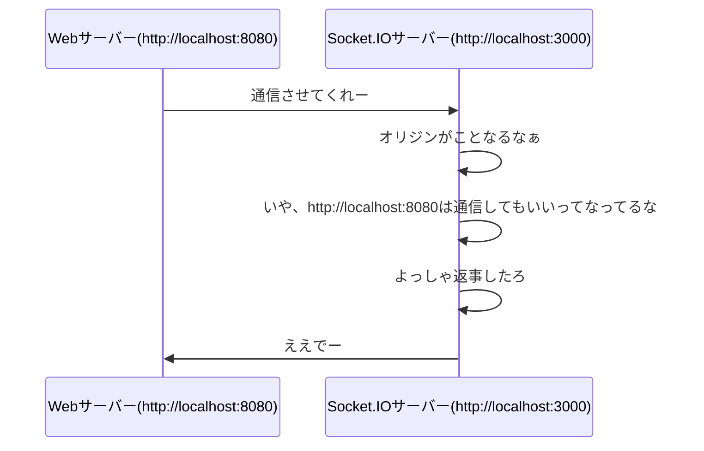


### まとめ

- Socket.IOを使った基本的なチャットアプリの実装が完了
- クライアントは何でも良いのでブラウザとコマンドライン同士でチャットもできる

